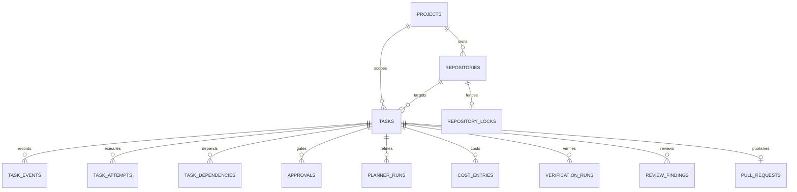

# Architecture

Praxrail begins as one deployable TypeScript service with explicit internal
boundaries:

- `domain`: task contracts, states, transition policy, risk, and approvals;
- `services`: transactional use cases and external-event orchestration;
- `persistence`: PostgreSQL repositories, migrations, events, and outbox;
- `jobs`: durable work, schedules, leases, locks, and retries;
- `integrations`: authenticated Telegram and GitHub adapters;
- `planner`: untrusted request classification behind a provider boundary;
- `observability`: logs, metrics, traces, and cost records; and
- `http`: validation and transport only.

PostgreSQL is authoritative. Telegram messages, GitHub payloads, logs, process
memory, and planner context are not sources of truth.

Every externally initiated operation follows this shape:

```text
authenticate -> validate -> deduplicate -> transact state + event -> enqueue
```

External side effects are created from durable records and retried idempotently.
No integration may mutate task state around the domain transition service.

## Persistent Model



Mutable task rows are projections. `task_events` is the append-only lifecycle
ledger, while incoming provider IDs, idempotency keys, webhook delivery IDs,
notification keys, and outbox keys provide replay boundaries. Raw message
payloads are retained only while needed for audit and incident response; a
scheduled cleanup policy must redact or remove them before production rollout.
